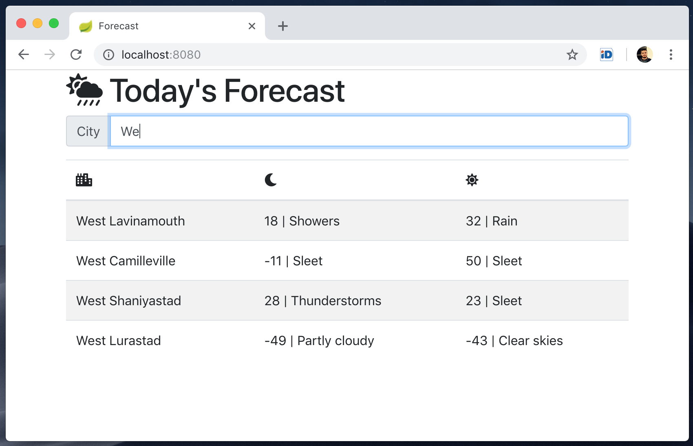

# Weather Project (Spring Boot + PostgreSQL + JavaScript)

## Applications
### weather-web / WebApplication.java
- [localhost:8080](localhost:8080) serves home page
- [localhost:8080/api/forecast](localhost:8080/api/forecast) serves forecast JSON

### weather-repository / TestApplication.java 
- ForecastRepositoryTest.java inserts mock data

## Settings
Preferences > Maven > Warnings > Disable "Version is duplicate of parent version" warning

