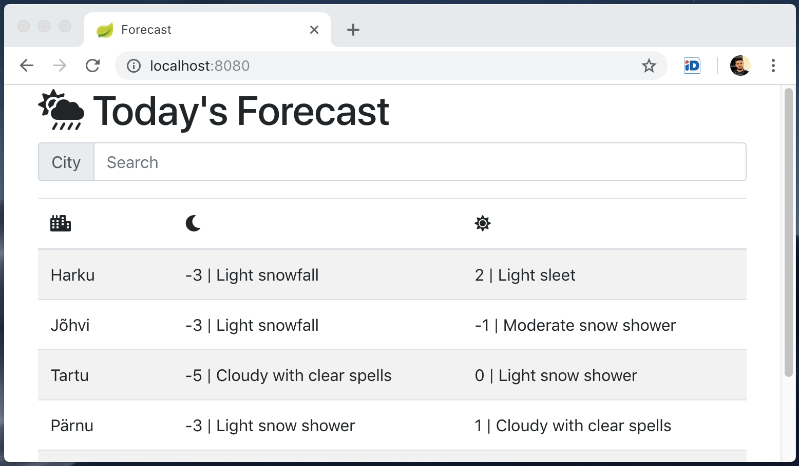

# Weather Project (Spring Boot + PostgreSQL + JavaScript)



## Applications
### weather-web / WebApplication.java
- [localhost:8080](localhost:8080) serves home page
- [localhost:8080/api/forecast](localhost:8080/api/forecast) serves forecast JSON
- web.properties holds Thymeleaf settings

### weather-scheduler / SchedulerApplication.java 
- ForecastTask.java is triggered by Cron and insert prod. forecast from [this url](http://www.ilmateenistus.ee/ilma_andmed/xml/forecast.php?lang=eng).
- scheduler.properties holds Cron & XML URL

### weather-repository / TestApplication.java 
- ForecastRepositoryTest.java inserts mock data
- repository.properties holds DataSource & JPA settings

## Settings
### Database
The application need a superuser access to a PostgreSQL database with the following properties:
```sh
Address: localhost:5432
Database: weather
Username: weather
Password: weather
```

### Eclipse
```
Preferences > Maven > Errors/Warnings >
- "groupId" duplicate of parent groupId
- "version" duplicate of parent groupId
```
